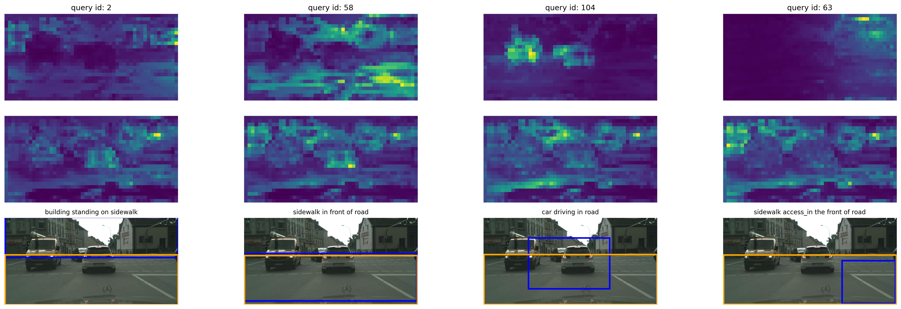

# Scene Graph Generation in Autonomous Driving: a neuro-symbolic approach
<a name="readme-top"></a>


<!-- PROJECT LOGO -->

<div align="center">
  <a href="https://github.com/Pamasi/sgg_av/">
    
  </a>

<h3 align="center"></h3>

  <p align="center">
    <br />
    <a href="https://github.com/Pamasi/sgg_av.git/issues">Report Bug</a>
    ·
    <a href="https://github.com/Pamasi/sgg_av/issues">Request Feature</a>
  </p>
</div>


<!-- TABLE OF CONTENTS -->
<details>
  <summary>Table of Contents</summary>
  <ol>
    <li>
      <a href="#about-the-project">About The Project</a>
      <ul>
        <li><a href="#built-with">Built With</a></li>
      </ul>
    </li>
    <li>
      <a href="#getting-started">Getting Started</a>
      <ul>
        <li><a href="#prerequisites">Prerequisites</a></li>
        <li><a href="#installation">Installation</a></li>
      </ul>
    </li>
    <li><a href="#usage">Usage</a></li>
    <li><a href="#contact">Contact</a></li>
    <li><a href="#acknowledgments">Acknowledgments</a></li>
  </ol>
</details>


<!-- ABOUT THE PROJECT -->
## About The Project

The master thesis explores the usage of a Neuro-Symbolic Relational TRansformer (Nesy-RelTR) in the context of Visual Relationship Detection for Autonomous Driving scenarios.

Distributed under the [Creative Commons Attribution](https://creativecommons.org/licenses/by-nc-nd/3.0/) Non-commercial No Derivatives.

If you find this project useful in your research, please consider cite:
```bibtex
@mastersthesis{sgg_av,
  author    = {Paolo E.I. Dimasi},
  title     = {Scene Graph Generation in Autonomous Driving: a Neuro-symbolic Approach},
  school    = {Politecnico di Torino},
  year      = {2023},
  address   = {Turin, Italy},
  url       = {http://webthesis.biblio.polito.it/id/eprint/29354}
}
```
<p align="right">(<a href="#readme-top">back to top</a>)</p>


<!-- GETTING STARTED -->
## Getting Started

### Prerequisites
Python 3.10+ 


### Installation


1. Clone the repo
   ```sh
   git clone https://github.com/Pamasi/sgg_av.git
   ```
2. Create an Anaconda environment
    ```bash
    conda create -n sgg_av_env python=3.10.12 
    conda activate sgg_av_env
    python -m pip install -r requirements.txt
    ```
3. Generate Traffic Genome dataset (folder coco_traffic_genome_v2) and its extension  with Visual Genome (folder coco_mix_dataset_v2)
    ```bash 
    . generate_tg.sh 
    ```
  


#### WARNING
Torchviz is not compatible with RelTR do not install it.
### Create RDF Knowledge graph from pandaset
  ```bash 
    python generate_kg/pandaset2RDF.py -f <pandaset-metadata-folder> -d <dataset-name> 
  ```

<p align="right">(<a href="#readme-top">back to top</a>)</p>


<!-- USAGE EXAMPLES -->
## Usage


### Knowledge Graph Embedding Generation
```bash 
  python train_kge.py
```
### RelTR: KGE 
```bash 
  python train_reltr.py --enable_kge --kge_path <kge_ckpt_path>
```

### RelTR: LTN
```bash
  python train_reltr.py --enable_ltn
```
## Inference
```bash
  python inference.py  --in_xywh --resume $model_path --img_path <image_path> --conf <confidence_score> --inf_dir <output-folder> 
```

<!-- CONTACT -->
## Contact

Email: [paolo.dimasi@outlook.com](mailto:paolo.dimasi@outlook.com)


<p align="right">(<a href="#readme-top">back to top</a>)</p>


<!-- ACKNOWLEDGMENTS -->
## Acknowledgments

* [RelTR: Relation Transformer for Scene Graph Generation](https://github.com/yrcong/RelTR.git)
* [Traffic Genome Dataset](https://github.com/Milomilo0320/Traffic-Scene-Graph-1000.git)
* [LTNtorch](https://github.com/tommasocarraro/LTNtorch.git)
* [nuScenes Knowledge Graph - A comprehensive semantic representation of traffic scenes for trajectory prediction](https://github.com/boschresearch/nuScenes_Knowledge_Graph.git)
* [pandaset-devkit](https://github.com/scaleapi/pandaset-devkit.git)

<p align="right">(<a href="#readme-top">back to top</a>)</p>


<!-- MARKDOWN LINKS & IMAGES -->
<!-- https://www.markdownguide.org/basic-syntax/#reference-style-links -->
[license-shield]: https://img.shields.io/github/license/Pamasi/sgg_av.svg?style=for-the-badge
[license-url]: https://creativecommons.org/licenses/by-nc-nd/3.0/
[linkedin-shield]: https://img.shields.io/badge/-LinkedIn-black.svg?style=for-the-badge&logo=linkedin&colorB=555
[linkedin-url]: www.linkedin.com/in/paolo-dimasi
